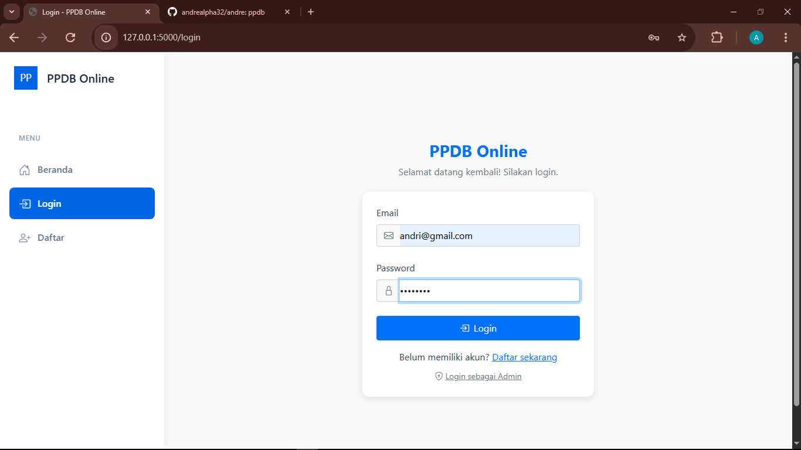

# 📘 User Manual - PPDB Online System

  
  <h3>Sistem Penerimaan Peserta Didik Baru Online</h3>
  
Panduan Lengkap Penggunaan Aplikasi

---

## 📋 Daftar Isi
1. [👋 Pendahuluan](#-pendahuluan)
2. [🚀 Memulai](#-memulai)
3. [📝 Proses Pendaftaran](#-proses-pendaftaran)
4. [💳 Pembayaran](#-pembayaran)
5. [📱 Fitur Siswa Baru](#-fitur-siswa-baru)
6. [👨‍💼 Panel Admin](#-panel-admin)
7. [❓ FAQ](#-faq)
8. [📞 Kontak & Bantuan](#-kontak--bantuan)

---

## 👋 Pendahuluan

PPDB Online adalah sistem pendaftaran siswa baru yang modern dan efisien. Sistem ini memungkinkan calon siswa untuk:
- Mendaftar secara online 24/7
- Mengupload dokumen secara digital
- Memantau status pendaftaran
- Melakukan pembayaran online
- Mengakses informasi orientasi siswa

### 💻 Persyaratan Sistem
- Browser modern (Chrome, Firefox, Safari, Edge)
- Koneksi internet stabil
- Perangkat dengan kamera (untuk foto dokumen)
- PDF Reader

---

## 🚀 Memulai

### Registrasi Akun
1. Kunjungi halaman utama PPDB Online
2. Klik tombol "Daftar Sekarang"
3. Isi formulir registrasi dengan:
   - Username
   - Email aktif
   - Password
4. Klik "Daftar" untuk membuat akun

### Login
1. Klik tombol "Login"
2. Masukkan username dan password
3. Klik "Masuk"

---

## 📝 Proses Pendaftaran

### Langkah 1: Pengisian Formulir
1. Login ke akun Anda
2. Klik menu "Form Pendaftaran"
3. Isi data pribadi:
   - Nama lengkap
   - Tempat & tanggal lahir
   - Alamat lengkap
   - No. telepon
   - Asal sekolah
   - Pilihan jurusan

### Langkah 2: Upload Dokumen
Siapkan scan/foto dokumen berikut:
- Ijazah/SKL *(max 2MB, format: PDF/JPG/PNG)*
- Akta kelahiran *(max 2MB, format: PDF/JPG/PNG)*
- Kartu Keluarga *(max 2MB, format: PDF/JPG/PNG)*
- Pas foto 3x4 *(max 2MB, format: JPG/PNG)*

### Langkah 3: Verifikasi
1. Submit formulir pendaftaran
2. Tunggu verifikasi admin (1-2 hari kerja)
3. Cek status di dashboard
4. Terima notifikasi via email

---

## 💳 Pembayaran

### Metode Pembayaran
- Transfer Bank
- Virtual Account
- E-Wallet

### Langkah Pembayaran
1. Klik menu "Pembayaran"
2. Pilih metode pembayaran
3. Upload bukti pembayaran
4. Tunggu verifikasi (1x24 jam)

---

## 📱 Fitur Siswa Baru

Setelah pendaftaran diverifikasi, Anda dapat mengakses:

### 📅 Jadwal Orientasi
- Lihat jadwal kegiatan
- Download materi
- Set pengingat acara

### 💬 Grup WhatsApp
- Bergabung grup jurusan
- Interaksi dengan siswa baru
- Info terkini dari sekolah

### 📚 Materi Persiapan
- Download modul pembelajaran
- Akses video orientasi
- Checklist persiapan sekolah

### 👥 Forum Diskusi
- Tanya jawab dengan siswa lain
- Sharing informasi
- Diskusi materi

---

## 👨‍💼 Panel Admin

### Fitur Admin
- Dashboard analytics
- Verifikasi pendaftaran
- Manajemen pembayaran
- Pengaturan jadwal
- Kelola grup & materi

### Alur Verifikasi
1. Login sebagai admin
2. Cek data pendaftar
3. Verifikasi dokumen
4. Update status
5. Kirim notifikasi

---

## ❓ FAQ

**Q: Berapa lama proses verifikasi?**  
A: 1-2 hari kerja setelah submit formulir.

**Q: Bagaimana jika dokumen ditolak?**  
A: Anda akan mendapat notifikasi untuk upload ulang.

**Q: Apakah bisa ganti jurusan?**  
A: Bisa, selama belum diverifikasi admin.

**Q: Dokumen apa yang wajib?**  
A: Ijazah/SKL, akta, KK, dan pas foto.

---

## 📞 Kontak & Bantuan

### Helpdesk
- Email: ppdb@sekolah.sch.id
- WhatsApp: 0812-3456-7890
- Jam kerja: 08.00-16.00 WIB

### Media Sosial
- Instagram: @ppdbonline
- Facebook: PPDB Online
- Twitter: @ppdbonline

### Alamat
Jl. Pendidikan No. 123  
Kota Pendidikan, 12345  
Indonesia

---

  
© 2024 PPDB Online System - All Rights Reserved

  
Made with ❤️ for kemudahan pendaftaran siswa baru

